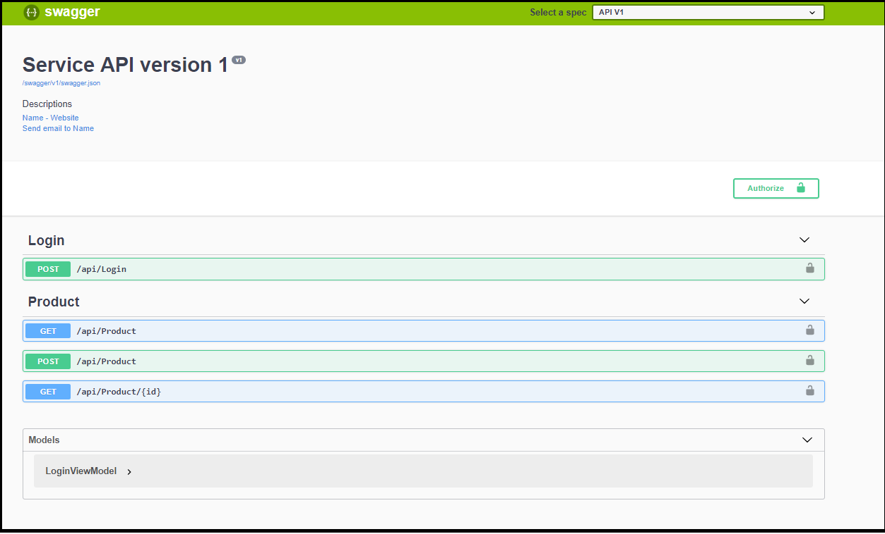

# netcore-webapi-structure

# The basic code structure for asp.net core web API project []
> A useful code structure for you, just coding, almost configuarations, features, useful thirdparty library already implemented .

## TAGS: Web API, ASP.NET CORE 2.1, Entity Framework Core,AutoMapper, Repository Pattern,JWT - Json Web Token, Swagger.



## Installation

OS X & Linux: install dotnet

```sh
dotnet restore
```

Windows:

```sh
dotnet restore
```

## Usage example

This project provided an neccessary code to build a web api project with net core.
In this project:
* Generate database using entity framework code first.
* Using Generic Repository Pattern to CRUD on the database.
* Dependency Injection.
* Handing global exception.
* Using middleware.
* Authorization api with JWT.
* Implement Swagger UI.
* Automation testing.
* Sercurity with SSL.


_For more update, please refer to the [Wiki][https://github.com/hieuxinhe/netcore-webapi-structure/wiki]._

## Development setup

As a .NET Developer, I familiar with Visual Studio. But with .NET Core, you also use Visual studio code and build it with command line. For example

```sh
dotnet restore
dotnet run
```

## Release History

* 0.1.0
    * CHANGE: Update docs (module code remains unchanged)

 
## Contributing

1. Fork it (<https://github.com/hieuxinhe/netcore-webapi-structure/fork>)
2. Create your feature branch (`git checkout -b feature/fooBar`)
3. Commit your changes (`git commit -am 'Add some fooBar'`)
4. Push to the branch (`git push origin feature/fooBar`)
5. Create a new Pull Request

[wiki]: https://github.com/hieuxinhe/netcore-webapi-structure/wiki
